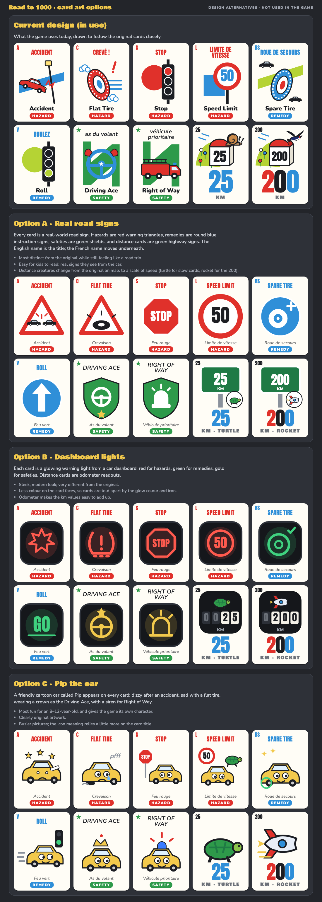

# Road to 1000

A two-player road race card game based on the French classic **Mille Bornes**, built to play on phones and iPads.

> **Disclaimer:** Road to 1000 is an independent fan project inspired by Mille Bornes. It is not affiliated with or endorsed by Dujardin, Asmodee or Hasbro. Mille Bornes is a trademark of its owner.

Open items are tracked in [TODO.md](TODO.md).

## Two versions

| | Family and friends version | Members version |
|---|---|---|
| **Link** | https://bcbarb24.github.io/road-to-1000/ | https://bcbarb24.github.io/road-to-1000/members/ |
| **Accounts** | None. Anyone with the link can play. | Sign in with an approved email. |
| **Online play** | Through free public message relays | Through Supabase (private to signed-in players) |
| **Saved** | Nothing beyond the current game on your device | Every move, every hand's results, per-player stats |
| **Admin page** | No | Yes: approve emails, see players, stats and game history |

Both versions have online play on two devices, pass and play on one device, and practice against the computer. They share the same cards and rules (`game-core.js`).

## Family and friends version

### Playing together on two devices

1. Both players open https://bcbarb24.github.io/road-to-1000/ on their own device.
2. One player types their name and taps **Host a game**. A 4-letter code appears (for example `KQ7M`). **Copy invite** copies the link and code to send in a text.
3. The other player types their name and the code, then taps **Join**.
4. Either player taps **Deal the cards**.

Moves travel between the two devices through free public message relays ([HiveMQ](https://www.hivemq.com/mqtt/public-mqtt-broker/) and [Eclipse Mosquitto](https://test.mosquitto.org/), over secure WebSockets). Every message goes through both, so the game keeps working if one is down. There's no server of our own and no sign-up.

If someone refreshes or loses connection, open the link again and tap **Rejoin** (guest) or **Go back to your game** (host). The host's device holds the game, so the host should avoid clearing their browser data mid-game.

The relays are public: anyone who knew your 4-letter game code could, in principle, watch or interfere with that game. Codes are random and only game moves are sent, so this is fine for family games, but don't use it for anything private.

### Pass and play (one device)

Two players share one iPad or phone. Tap **Pass and play** on the home screen and enter both names. Between turns a cover screen says whose turn it is and hides the cards; the next player taps **Show my cards** when they're holding the device. The game is saved on the device, so you can close the page and pick it up later with **Continue**.

### Practice

**Practice vs Robo** plays against a computer opponent on one device, with no connection needed.

## Members version

https://bcbarb24.github.io/road-to-1000/members/

The same game with sign-in and tracking:

- **Sign-in:** enter an approved email and tap the link that arrives (no passwords). The first time, choose the name other players will see.
- **Home:** your games in progress (**Continue** / **End**), Play online (host or join with a code), Pass and play, and Practice. Only online games are saved.
- **Saved games:** every move, each finished hand's score breakdown and play-by-play, and the game winner.
- **My stats and history:** hands played and won, trips to 1000, games won, total points and km, recent hands, and full game history.
- **Admin page** (admins only): approve or remove emails, see who has signed up and when they were last seen, per-player stats, and every game hand by hand.

It runs on [Supabase](https://supabase.com) (sign-in, database and live updates), free plan.

### Security

- Only emails on the approved list can create an account: a sign-up hook rejects everyone else.
- The database's row-level security rules limit what each signed-in player can see or change: players see their own profile, stats and games; only admins see the approved list, all players and all games. Anonymous visitors can't read or write anything. (Tested in `supabase/schema.sql` against each kind of user.)
- The key in `members/index.html` is Supabase's *publishable* key, which is meant to be public; the security rules are what protect the data. Never put a secret or service_role key in the page.
- In an online game the host's device applies the rules and saves the state, so a host could in principle tamper with their own game. Fine among family and friends; not for competitive play.

### Supabase setup (one time)

Already done for this project except where marked. Steps, for reference or for a new project:

1. **Create the project** with *Enable Data API* on, *Automatically expose new tables* off, and *Enable automatic RLS* on.
2. **Run [`supabase/schema.sql`](supabase/schema.sql)** in the SQL Editor, after changing `owner@example.com` near the end to the email you'll sign in with. It creates the tables, security rules, sign-up hook function and stats views, and approves that email as admin.
   - **Warning:** the script drops and recreates its tables. Running it again **erases the approved list and all game history**. Make later changes with a separate migration script.
3. **Turn on the sign-up hook:** Authentication → Hooks → Before User Created → Postgres → `public.hook_before_user_created`.
4. **Set the sign-in return address:** Authentication → URL Configuration. Site URL `https://bcbarb24.github.io/road-to-1000/members/`; add `https://bcbarb24.github.io/road-to-1000/members/**` to Redirect URLs.
5. **Set up an email sender (still to do):** Supabase's built-in email only delivers sign-in links to members of the Supabase account and only a few per hour. For other players to sign in, add your own SMTP sender under Authentication → Emails → SMTP Settings (for example Gmail with an app password), or enable Google sign-in under Authentication → Sign In / Providers. A **Continue with Google** button appears automatically once Google is enabled.
6. **Put the project URL and publishable key** in `members/index.html` (`SUPABASE_URL`, `SUPABASE_KEY`).

## Rules in brief

- Race to exactly **1000 km**. Each turn, draw a card, then play one or throw one away.
- Play **Roll** (green light) before you can drive, then distance cards (25–200 km; max two 200s per hand).
- **Hazards** (Accident, Out of Gas, Flat Tire, Stop, Speed Limit) slow your opponent; **Remedies** fix them.
- **Safeties** protect you for the rest of the hand, and playing one gives you an extra turn. There is one of each:
  - **Driving Ace** (*As du volant*): no more Accidents.
  - **Extra Tank** (*Citerne d'essence*): no more Out of Gas.
  - **Puncture-Proof** (*Increvable*): no more Flat Tires.
  - **Right of Way** (*Véhicule prioritaire*): no more Stops or Speed Limits, and you never need a Roll card to drive.
- **Coup fourré:** if someone plays a hazard on you while you hold the safety that blocks it, play that safety at the start of your next turn. It cancels the hazard and earns a 300-point bonus on top of the safety's 100.
- **Reshuffle (house rule):** when the draw pile runs out, the thrown-away cards are shuffled into a new draw pile, as many times as needed. If nobody plays a card through a whole pile, reshuffling stops and the hand is played out without drawing, as in the official rules. (Officially the discard pile is never reused.)
- Standard scoring: 1 point per km, 100 per safety, 300 for all four, 300 per coup fourré, 400 for finishing, and bonuses for a delayed action (finishing after every card has been drawn), a safe trip and a shutout. First to 5000 points wins.

## Design alternatives

The game uses the current card design. Three alternative card art directions were mocked up for reference (10 sample cards each) and are **not used in the game**:

- **Option A, real road signs:** hazards as red warning triangles, remedies as round blue signs, safeties as green shields, distance cards as green highway signs.
- **Option B, dashboard lights:** each card is a glowing dashboard warning light; distance cards are odometer readouts.
- **Option C, Pip the car:** a cartoon car mascot on every card.

All three move further from the original Mille Bornes artwork, put the English name first, and replace the original distance animals with a speed scale (turtle to rocket). See [`design/art-options.png`](design/art-options.png), or the live page at https://bcbarb24.github.io/road-to-1000/design/art-options.html.

No build step; GitHub Pages serves the files as they are.

| File | What it is |
|---|---|
| `index.html` | Family and friends version (home screens, public-relay online play) |
| `members/index.html` | Members version (sign-in, Supabase online play, stats, admin) |
| `game-core.js` | Shared by both: cards and artwork, rules, reshuffle, scoring, computer player, table rendering |
| `game.css` | Shared styles |
| `supabase/schema.sql` | Members database: tables, security rules, sign-up hook, stats |
| `design/` | Alternative card art mockups (reference only, not used in the game) |

To run locally, serve the folder (`python3 -m http.server`) and open `http://localhost:8000/`.

Card artwork is original, drawn in SVG in the style of the classic game.
